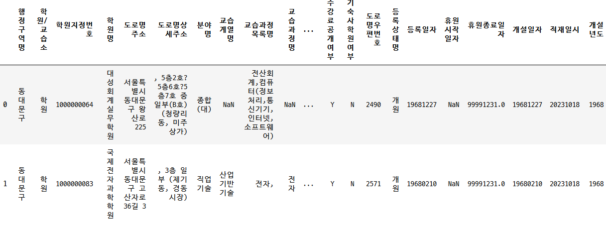
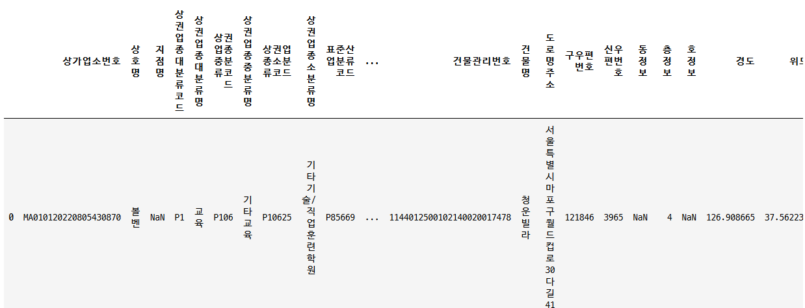
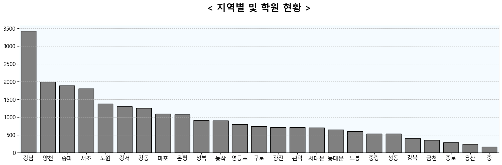
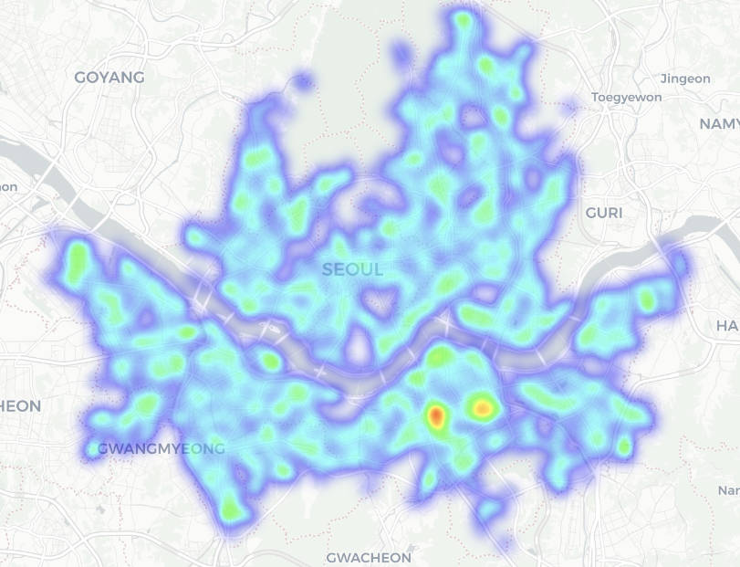
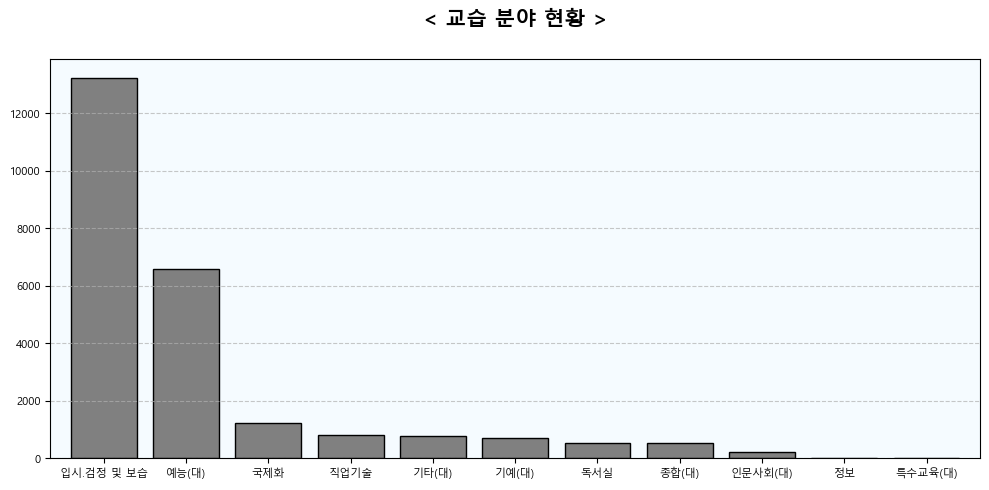
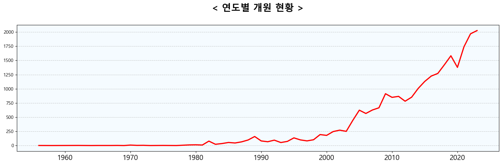
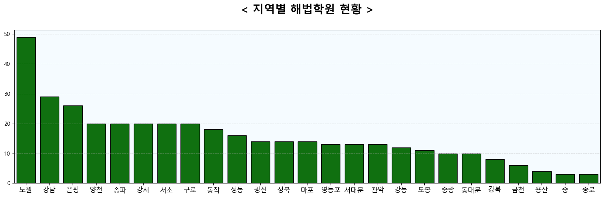
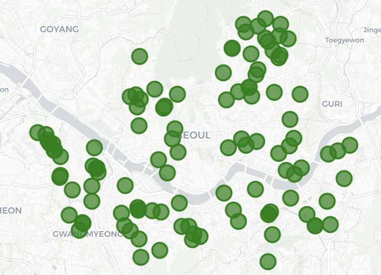
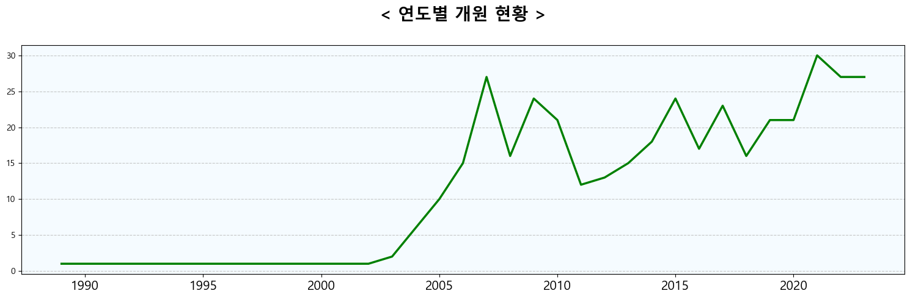

# **서울특별시 학원 및 교습소 현황 분석**

> 서울시내 학원 데이터를 기반으로 

---

## **목차**
1. [개요](#개요)
2. [데이터](#데이터)
3. [분석 프로세스](#분석-프로세스)
4. [결과](#결과)
6. [라이브러리](#라이브러리)
<!-- 7. [참고자료](#참고자료) -->

---

## **개요**
- 주제 선정 배경
  - 에듀테크 PM으로서 교육데이터 분석 경험을 쌓기 위해 진행.
  - 학원 및 교습소 현황을 파악하여 ~
---
- 목표
  - 시각화 등을 통해 연도별 서울시내 학원 및 교습소 현황 파악. 
  - 천재교육 산하 해법학원 현황 파악.

---

## **데이터**

- [서울시 학원 교습소정보](http://data.seoul.go.kr/dataList/OA-20528/S/1/datasetView.do)

    
  -  서울특별시 학원 및 교습소의 개설년도, 등록번호 , 주소 등을 보유.
  - 각종 plot 시각화에 활용.
  - (24527, 23)
---
- [소상공인시장진흥공단_상가(상권)정보](https://www.data.go.kr/data/15083033/fileData.do)

  
  - 국내 모든 상권의 위도, 경도, 업종 분류 등의 정보를 보유.
  - '서울시'내 '학원' 업종만 필터링하여 사용.
  - 위도, 경도 정보를 활용해 Folium Map 시각화에 사용.
  - (26186, 39)
---

## **분석 프로세스**
- **지역별 학원 및 교습소 현황**:
  - Plot
      

  - Folium Map
      
---

- **교습분야별 학원 및 교습소 현황**:
  - Plot
   
---

- **연도별 학원 및 교습소 개원 현황**
  - Plot
  
---
- **지역별 '해법학원' 현황**
  - plot
  

  - Folium Map
  
---
- **연도별 해법학원 개원 현황**
  - Plot
  
---

## **결과**

---

## **라이브러리**
- Python 버전: `>=3.8`
- 주요 라이브러리:
  - `pandas`, `numpy`, `matplotlib`, `seaborn`
---

<!-- ## **참고자료**
- 데이터 출처 또는 관련 문서:
  - [서울특별시 열린데이터광장](https://data.seoul.go.kr)
  - 관련 논문, 블로그 링크 등 -->
