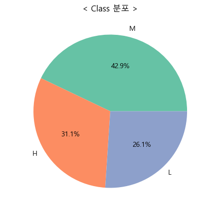
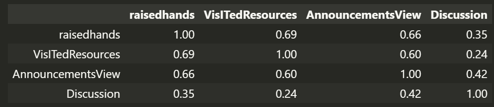
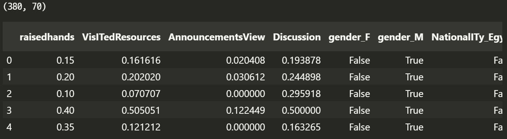
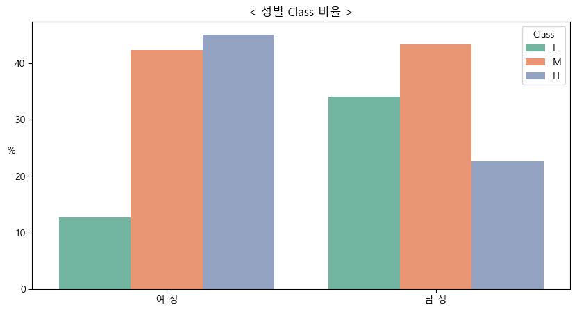
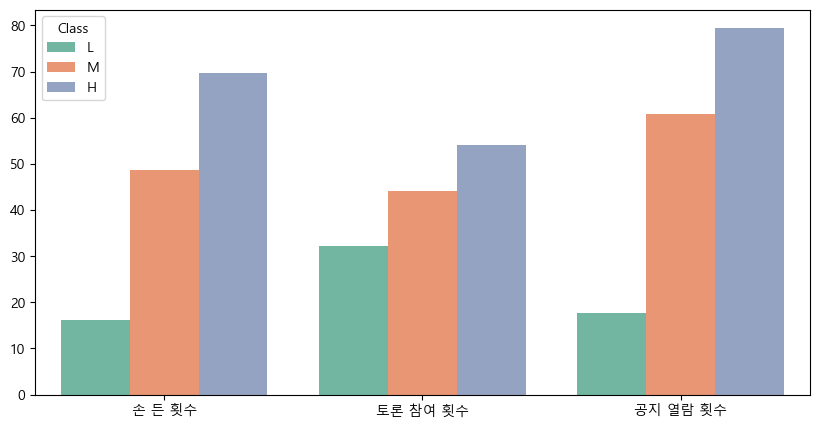
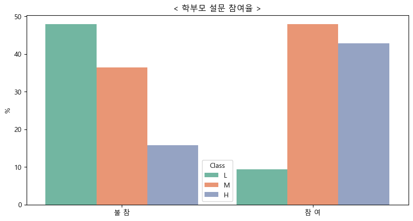

# **학업 성취도 예측**

> 학생 수업 참여도, 부모의 학업 관심도 등에 따른 학업 성취도 예측

---

## **목차**
1. [개요](#개요)
2. [데이터](#데이터)
3. [분석 프로세스](#분석-프로세스)
4. [결과](#결과)
6. [라이브러리](#라이브러리)
<!-- 7. [참고자료](#참고자료) -->

---

## **개요**
- 프로젝트 배경 및 문제 정의
  - 에듀테크 PM으로서 교육데이터 분석 경험을 쌓기 위해 진행.
  - 학업성취도에 영향을 끼치는 요인은 어떤 요소일지 궁금함.
- 목표
  - 학생들의 인구통계, 행동, 교육 데이터를 기반으로 학업 성과를 예측. 
  - 결석, 부모 만족도, 학교 활동 참여도와 같은 다양한 요인을 분석하여, 학생들의 학업 성과를 "낮음(L)", "중간(M)", "높음(H)"으로 분류하는 분류 모델을 구축.

---

## **데이터**
- 출처:
  - [Students' Academic Performance Prediction(MEGA)](https://www.kaggle.com/competitions/students-academic-performance-prediction-mega#)
- 설명:
   - 인구통계: 성별, 국적, 학년 등
   - 행동: 손들기 횟수(raisedhands), 학습 자료 방문 횟수(VisITedResources), 토론 참여 횟수(Discussion) 등
   - 부모 설문조사: 부모 설문 참여 여부(ParentAnsweringSurvey), 부모의 학교 만족도(ParentschoolSatisfaction) 등
   - 출석: 결석 일수(StudentAbsenceDays)
   - 학업성취도(종속변수): "낮음(L)", "중간(M)", "높음(H)"으로 분류
- 전처리:
  - 결측값 없음, 중복 데이터 없음.
  - 범주형 데이터: One-Hot-Encoding
  - 연속형 데이터: Min-Max-Scaling

---

## **분석 프로세스**
1. **탐색적 데이터 분석 (EDA)**:
   - Class 비율
   
     
   - 변수간 상관관계
   
2. **전처리**:
   - 결측값, 중복 데이터 없음.
   - 범주형 데이터: One-Hot-Encoding
   - 연속형 데이터: Min-Max-Scaling
   
3. **모델링 및 분석 방법**:
   - `RandomforestClassifier`
4. **모델 평가**:
   - 정확도(Accuracy): 약 0.83

---

## **결과**
- 남학생보다 여학생들의 학업성취도가 전반적으로 높음.

- 수업 참여도가 높은 학생들의 학업성취도가 높음.

- 부모의 학업 관심도가 높은 학생들의 학업성취도가 높음.

---

## **라이브러리**
- Python 버전: `>=3.8`
- 주요 라이브러리:
  - `pandas`, `numpy`, `matplotlib`, `seaborn`, `sklearn`

---

<!-- ## **참고자료**
- 데이터 출처 또는 관련 문서:
  - [서울특별시 열린데이터광장](https://data.seoul.go.kr)
  - 관련 논문, 블로그 링크 등 -->
